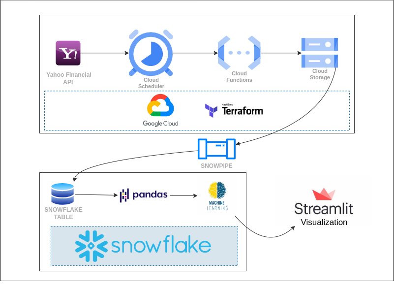

# ml-stock-predictor

## Project

The project will take data from the yahoofinancial api. The data will be fetched every day for the day before then stored in a gcs. Then data will be copy into snowflake through a snowpipe runned with pub/sub. We will try to analyze the data, build a machine learning model to predict futur trends and serve it through a streamlit webapp.

## Architecture

## Tools & Technologies

- Cloud - [**Google Cloud Platform**](https://cloud.google.com)
- Infrastructure as Code software - [**Terraform**](https://www.terraform.io)
- Orchestration - [**Cloud Scheduler**](https://cloud.google.com/scheduler/)
- Transformation - [**Pandas**](https://pandas.pydata.org/)
- Data Lake - [**Google Cloud Storage**](https://cloud.google.com/storage)
- Ingestion - [**Snowpipe**](https://docs.snowflake.com/en/user-guide/data-load-snowpipe-intro)
- Data Warehouse - [**Snowflake**](https://www.snowflake.com/en/)
- Exploratory Analysis - [**Plotly**](https://plotly.com/graphing-libraries/)
- Machine Learning Model - [**Prophet**](https://facebook.github.io/prophet/)
- Data Visualization - [**Streamlit**](https://streamlit.io/)
- Language - [**Python**](https://www.python.org)

## Webapp

A streamlit app to display info about stocks. You can then make a prediction about the futur trends and select how much day you want to predict.

